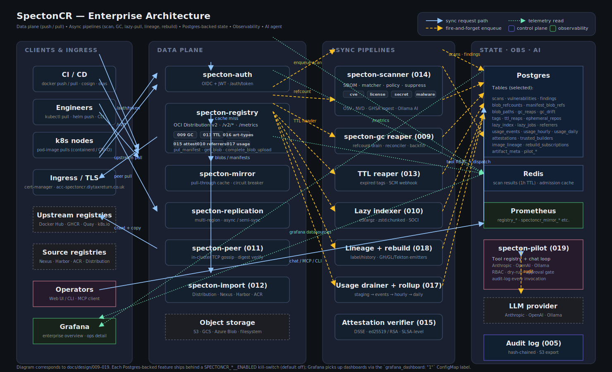

# SpectonCR Architecture

A single mapped diagram of the enterprise feature set.



## Reading guide

The diagram has four lanes:

| Lane               | Contents                                                                            |
| ------------------ | ----------------------------------------------------------------------------------- |
| **Clients & ingress** | CI/CD, engineers, k8s pod pulls, the Ingress + TLS cert-manager, plus three external dependencies (upstream registries, source registries, LLM provider) and the operator entrypoints (Web UI, Grafana). |
| **Data plane**     | The synchronous registry path: `specton-auth`, `specton-registry`, the `specton-mirror` pull-through cache, multi-region `specton-replication`, the P2P `specton-peer` mesh, the `specton-import` migration runner, and the object store. |
| **Async pipelines** | Every fire-and-forget worker: `specton-scanner` (CVE / license / secret / malware), the GC reaper + reconciler (009), the TTL reaper (013), the lazy-pull indexer (010), lineage capture + rebuild emitters (018), the usage drainer + rollups (017), and the DSSE attestation verifier (015). |
| **State · obs · AI** | Postgres tables that back every persistent feature, Redis for ephemeral scan results, Prometheus, the AI agent (`specton-pilot`, 019), the LLM provider, and the hash-chained audit log (005). |

## Arrow legend

- **Solid blue** — synchronous request path. Client waits.
- **Dashed amber** — fire-and-forget enqueue. The hot path returns immediately and the work happens later.
- **Dotted green** — read-only telemetry. Prometheus scraping `/metrics`, Grafana querying Postgres / Prometheus for dashboards.

## Where each feature lives

| Slice / feature              | Component on the diagram                  |
| ---------------------------- | ----------------------------------------- |
| 005 audit log                | State · obs · AI lane (bottom)            |
| 009 online GC                | specton-registry (refcount writer) + GC reaper + Postgres tables |
| 010 lazy pull                | Lazy indexer (async) + specton-registry referrers route |
| 011 P2P pull mesh            | specton-peer in the data-plane lane        |
| 012 migration importer       | specton-import in the data-plane lane      |
| 013 ephemeral repos / TTL    | specton-registry TTL header + TTL reaper   |
| 014 extended scanning        | specton-scanner box (cve/license/secret/malware pills) |
| 015 SLSA attestations        | Attestation verifier in async pipelines + specton-registry attestation upload route |
| 016 typed artifacts          | specton-registry "art-types" pill          |
| 017 cost telemetry           | specton-registry "usage" pill + usage drainer + Grafana panels |
| 018 auto-rebuild             | Lineage + rebuild box                     |
| 019 AI agent                 | specton-pilot in the AI lane               |

## Editing

The SVG is hand-authored — `docs/architecture/spectoncr-enterprise.svg`. To
change a label, fix a flow, or add a feature, edit the SVG directly and run:

```bash
python3 -c "import xml.etree.ElementTree as ET; ET.parse('docs/architecture/spectoncr-enterprise.svg')"
```

to lint. GitHub renders SVG inline so the README above will pick up changes automatically.
