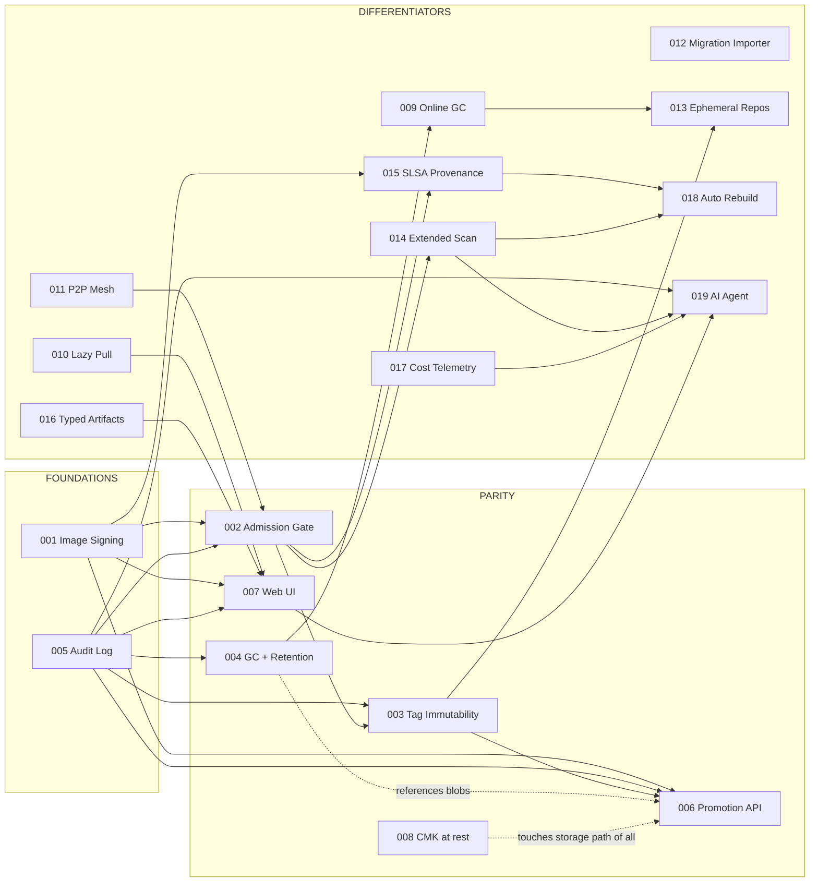

# NebulaCR Next-Major-Release Design Index

Nineteen feature designs targeting parity with — and beyond — Azure
Container Registry, Sonatype Nexus, and Harbor. Each per-feature doc
follows the nine-section template (problem / approach / CRD / routes /
schema / failure / migration / test / slice count) defined in
[PROMPT.md](./PROMPT.md).

All designs honour the project memory rulings: VulnDB and Queue stay behind
traits; new persistent state goes in Postgres; Redis stays ephemeral; every
feature has a `nebulacr.toml` kill-switch defaulting to OFF.

The first eight features (001–008) target ACR / Nexus parity. Features
009–019 are the open-source-launch differentiators — operational pain
killers Nexus and Harbor have never solved (online GC, lazy pulls, P2P,
migration importer) plus net-new capabilities (typed artifacts, cost
telemetry, auto-rebuild, AI agent).

## Status

### Parity gap closure (originally scoped)

| #   | Feature                          | Doc                                            | Status   | Effort   |
| --- | -------------------------------- | ---------------------------------------------- | -------- | -------- |
| 001 | Cosign/Notation image signing    | [001-image-signing.md](./001-image-signing.md) | proposed | 4 slices |
| 002 | Pull-time admission gate         | [002-admission-gate.md](./002-admission-gate.md) | proposed | 3 slices |
| 003 | Tag immutability + quarantine    | [003-tag-immutability-quarantine.md](./003-tag-immutability-quarantine.md) | proposed | 3 slices |
| 004 | Garbage collection + retention   | [004-gc-retention.md](./004-gc-retention.md)   | proposed | 4 slices |
| 005 | Append-only signed audit log     | [005-audit-log.md](./005-audit-log.md)         | proposed | 3 slices |
| 006 | Atomic promotion API             | [006-promotion-api.md](./006-promotion-api.md) | proposed | 3 slices |
| 007 | Web UI parity                    | [007-web-ui-parity.md](./007-web-ui-parity.md) | proposed | 4 slices |
| 008 | CMK / envelope encryption at rest | [008-cmk-encryption-at-rest.md](./008-cmk-encryption-at-rest.md) | proposed | 4 slices |

### Open-source-launch differentiators (009–019)

| #   | Feature                          | Doc                                            | Status   | Effort   |
| --- | -------------------------------- | ---------------------------------------------- | -------- | -------- |
| 009 | Online GC (zero RO window)       | [009-online-gc.md](./009-online-gc.md)         | proposed | 4 slices |
| 010 | Lazy pulling (eStargz / SOCI)    | [010-lazy-pull.md](./010-lazy-pull.md)         | proposed | 4 slices |
| 011 | P2P pull mesh                    | [011-p2p-pull.md](./011-p2p-pull.md)           | proposed | 5 slices |
| 012 | Migration importer (Nexus/Harbor/ACR) | [012-migration-importer.md](./012-migration-importer.md) | proposed | 5 slices |
| 013 | Ephemeral repos + TTL tags       | [013-ephemeral-repos.md](./013-ephemeral-repos.md) | proposed | 3 slices |
| 014 | License / secret / malware scan  | [014-extended-scanning.md](./014-extended-scanning.md) | proposed | 4 slices |
| 015 | SLSA provenance + in-toto        | [015-slsa-provenance.md](./015-slsa-provenance.md) | proposed | 3 slices |
| 016 | Typed artifacts (Helm/WASM/AI/TF) | [016-typed-artifacts.md](./016-typed-artifacts.md) | proposed | 4 slices |
| 017 | Cost & pull-telemetry            | [017-cost-telemetry.md](./017-cost-telemetry.md) | proposed | 3 slices |
| 018 | Auto-rebuild on base CVE patch   | [018-auto-rebuild.md](./018-auto-rebuild.md)   | proposed | 3 slices |
| 019 | AI agent (`nebula-pilot`)        | [019-ai-agent.md](./019-ai-agent.md)           | proposed | 5 slices |

A "slice" is calibrated against the scanner work — each is roughly one week
of engineer time including tests and docs.

## Dependency graph

Solid arrows = hard dependency. Dashed = same code path; sequencing matters.

## Critical path

**Ship 005 (Audit Log) and 001 (Image Signing) first.** Together they unblock
the most other features in the parity tier and form the substrate the
differentiators (014, 015, 018, 019) layer on.

- **005 unblocks 002, 003, 004, 006, 007, 019.** Every state-changing feature
  needs a durable, queryable audit record. The current in-memory ring buffer
  (`crates/nebula-registry/src/audit.rs:43`) cannot survive a restart and
  cannot be shown in a UI timeline. A real append-only Postgres log with a
  hash chain is the substrate every other feature writes to. 019's AI
  agent specifically requires it for safe destructive ops.
- **001 unblocks 002 (signature-required policy), 006 (signatures must be
  copied during promotion), 007 (signature viewer page), and 015
  (attestations are signed envelopes).** The cosign artifact convention
  also informs how 003's quarantine state is exposed (referrers API).

If only one slot is available, do 005 first — it is genuinely a substrate;
001 is a feature that consumes its substrate.

### Differentiator critical path

After the parity tier lands, the highest-leverage differentiators to ship
next are **009 (Online GC)** and **012 (Migration Importer)**:

- **009** turns the operational story from "schedule a maintenance
  window" into "GC is on by default, never blocks writes." It supersedes
  004's mark-and-sweep model; 004 stays as the periodic reconciler.
- **012** removes the single biggest reason teams stay on Nexus —
  switching cost. One command imports their entire Nexus / Harbor / ACR
  registry into NebulaCR with retention rules and permissions translated.

After those two, 019 (AI agent) is the credible "wow" feature for the
open-source launch story; it depends on a healthy 005 + 014 + 017 to be
useful.

## Cross-cutting decisions (locked)

- **Pure Rust.** Signing uses `sigstore-rs`; no shelling out to `cosign`.
  Notation support is behind a `Verifier` trait; first impl is sigstore-only.
- **Postgres for new persistent state.** New tables: `signatures`,
  `verification_policies`, `audit_log`, `tag_state`, `gc_runs`, `promotions`,
  `wrapped_deks`. Redis only caches ephemeral admission decisions
  (sub-minute TTL).
- **2-segment and 3-segment paths** are first-class for every new route,
  matching the existing pattern at `crates/nebula-registry/src/main.rs:2924-2980`.
- **Kill-switch in `nebulacr.toml`** under each feature's section, default
  `enabled = false`. Existing deployments are no-op upgrades.
- **CRD additions are additive only.** `Project.spec.immutable_tags` and
  `Project.spec.retention_policy` already exist
  (`crates/nebula-controller/src/main.rs:88-112`); 003 and 004 extend them.
- **CLI surface (`nebulacr`) and MCP tool surface (`nebula-mcp`) are
  designed alongside the HTTP routes**, not bolted on.
